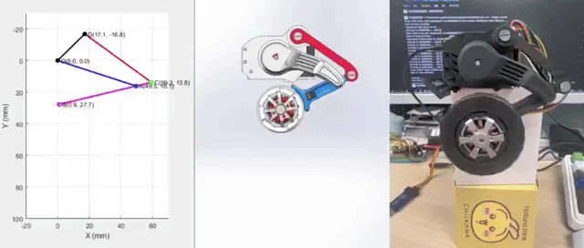
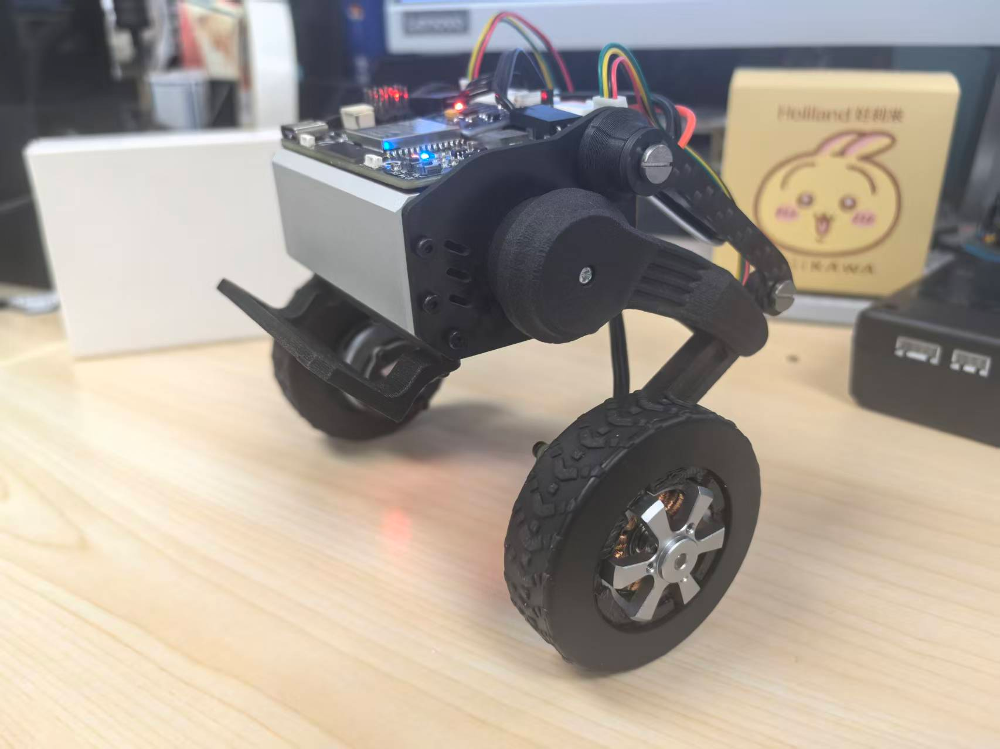
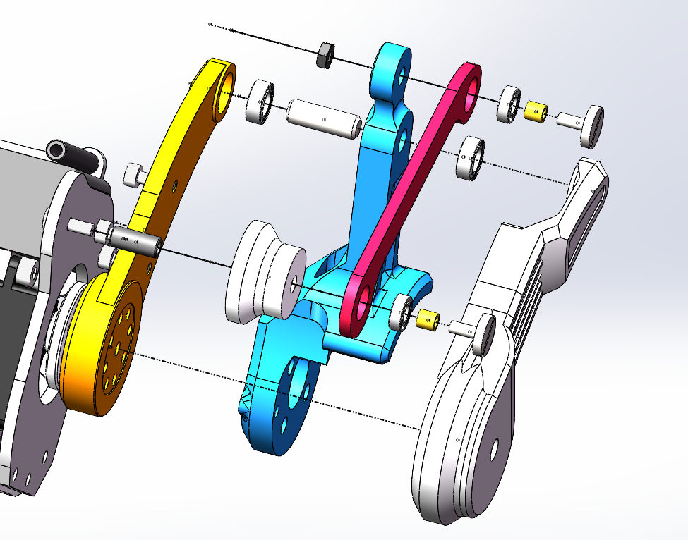

基于 ESP32 微控制器设计并实现了一套桌面级双轮足机器人系统，采用**轮足复合结构**，通过舵机驱动的可变轮轴高度**四连杆机构**实现轮式运动与类足姿态调节，并调节整机中心位置结合PID与FOC 控制整机平衡。

_整机模型图_

_腿部（四连杆）机构运动演示_

机器人本体使用**碳纤维**板拼合而成，前护板使用**6061铝合金**材料，通过**配重设计**与后部电池配重平衡，调节整机**重心位置**，方便控制整机平衡。腿部机构，大腿、小腿、轮子使用**尼龙烧结**打印，连杆使用**碳纤**维，轮子外侧包裹行李箱轮子**橡胶套**防止打滑。

轮子内电机为2208电机，使用AS5600磁编码器，陀螺仪使用IMU6050。

_实物照片_

舵机使用了飞特STS3032舵机，其拥有4.5 kg·cm的堵转扭力，使机器人可以完成**跳跃**等动作。

_跳跃演示_

腿部机构使用大头螺钉 +  直通铜柱和圆柱销作为转轴。

_腿部机构爆炸图_

