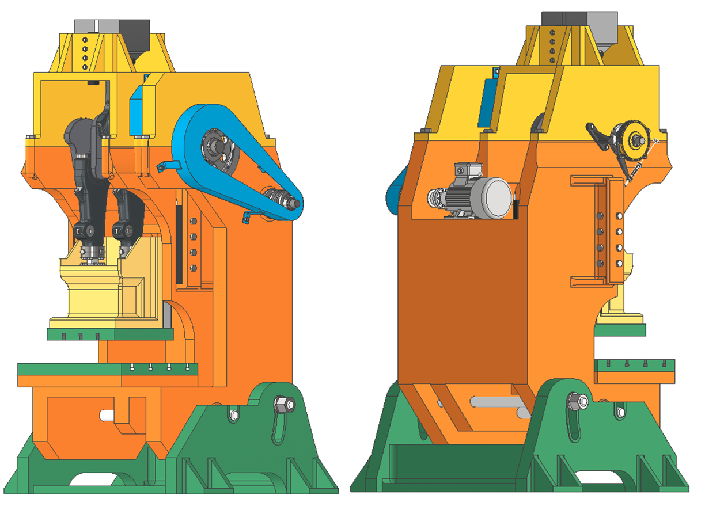
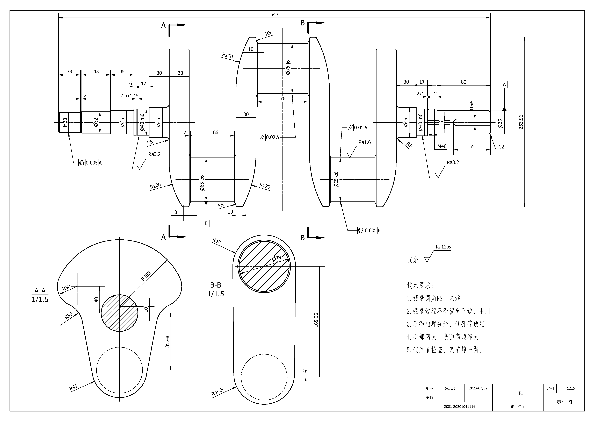
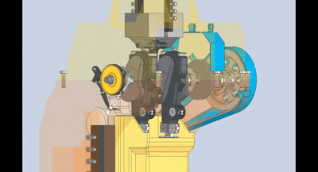
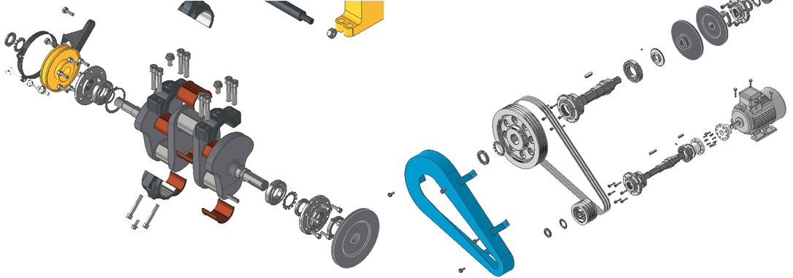
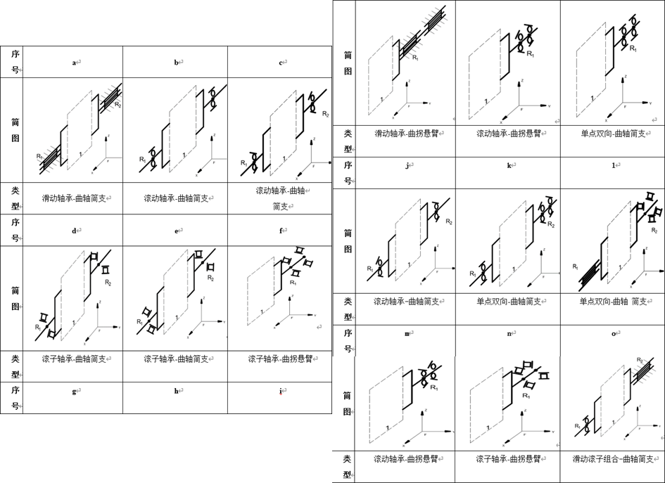
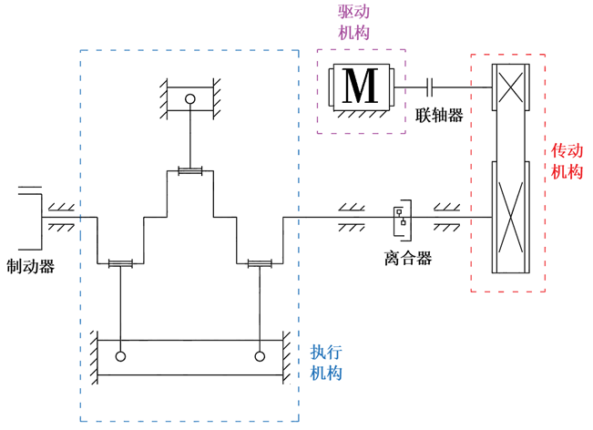
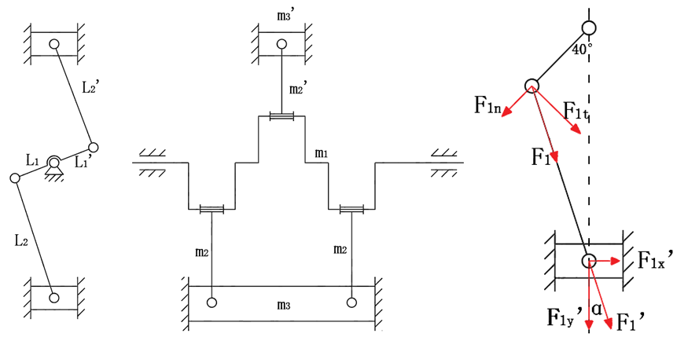
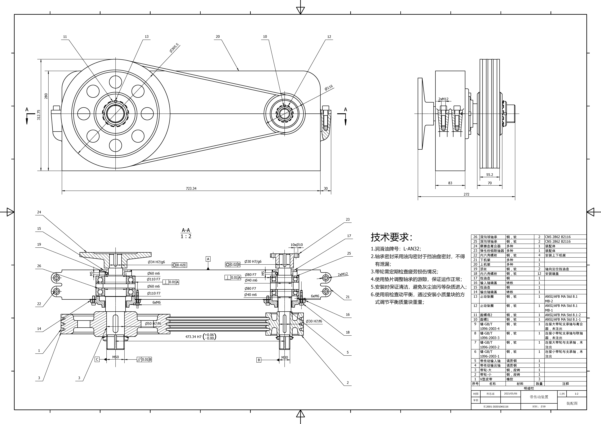
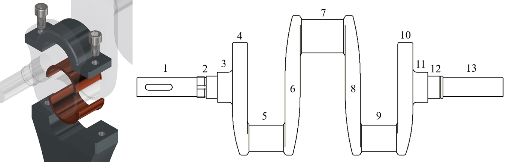
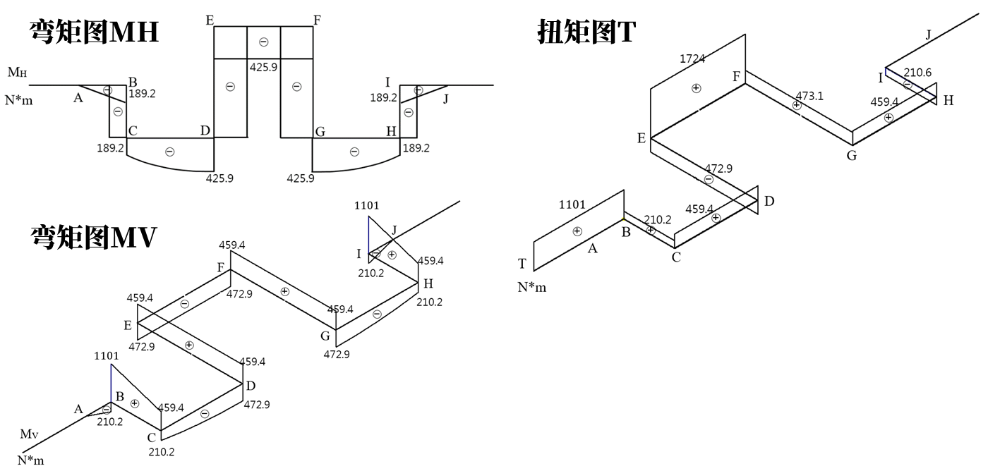

> 项目来源于韩思源 2023 年大连理工大学机械设计的课程设计。

本项目围绕一台小型高速**曲柄滑块压力机**展开。目标是在满足 20 kN 标称冲压力、400 次/分钟冲压频率 的前提下，完成**整机方案设计**、**关键机构尺寸计算**、**传动系统设计**以**及强度与刚度校核**。




 *整机模型图*


 *整机装配图*



*关键零件图—曲轴零件图*



*动画展示*




*部分爆炸图—执行&传动系统*

### 整机方案设计




设计多种执行构件结构方案与传动方案，最终采用如下图的**整机方案**。



*整机方案简图*

### 关键机构设计

#### 执行机构




- 电机选型

```
取公称压力角 α_g = 40°，α = 8°
L1 = S_h / (1 − cos α_g) = 85.48 mm
L2 = (L1 · sin 40°) / sin α = 394.80 mm
m1 = 20 kg，m3′ = m3 = 20 kg
m2 = 5 kg，m2′ = 2 m2 = 10 kg
最大冲击转矩：
T = (F · L1 · cos(50° − α)) / cos α = 1282.97 N·m
计算平均转矩：
∫(φ1 → φ2) M(φ) dφ = K · M |(φ = φ1) · (φ2 − φ1)
Me = K · M瞬 · (φ2 − φ1) / (2π) = 57.02 N·m
计算曲柄滑块压力机的功率：
PW = (N · F · s_h) / (60 × 1000) = 2.67 kW
传动效率 η：
η = η_联轴器 × η_V带 × (η_滚轴)^3 × (η_滑轴)^4 × (η_滚导)^4 × η_离合器
η = 0.792
所需电机功率：
Pr = PW / η = 3.37 kW
所需电机转速：
nd = i × nw = 1200 r/min
```

- 各轴动力参数

```
0 轴：即电动机轴
P0 = 3.37 kW
n0 = 1440 × (1 − 0.15) = 1224 r/min
T0 = 9.55 · P0 / n0 = 26.29 N·m
Ⅰ轴：即带传动带轮的高速轴
PⅠ = 3.27 kW
nⅠ = 1224 r/min
TⅠ = 9.55 · PⅠ / nⅠ = 25.51 N·m
Ⅱ轴：即带传动带轮的输出轴
PⅡ = 3.04 kW
nⅡ = 400 r/min
TⅡ = 72.58 N·m
Ⅲ轴：即曲轴
PⅢ = 2.89 kW
nⅢ = 400 r/min
TⅢ = 69.00 N·m
```

#### 传动机构



```
计算功率 Pca：
Pca = KA · P = 3.597 kW（KA = 1.1）
选用：A 型 V 带
主动轮基准直径 dd1：
dd1 = 100 mm
从动轮基准直径 dd2：
dd2 = [n1 · (1 − ε) / n2] · dd1 = 299.88 mm，取 dd2 = 300 mm
带速验算：
v = (π · dd1 · n1) / (60 × 1000) = 6.41 m/s
传动比误差 Δi：
Δi = (i′ − i) / i × 100%
= (3.0612245 − 3.06) / 3.06 × 100%
= 0.04%
初步计算 V 带长度 Ld0：
Ld0 ≈ 1453.32 mm
查表 15-7，选取 V 带基准长度 Ld：
Ld = 1600 mm
计算实际中心距 a：
a ≈ a0 + (Ld − Ld0) / 2 = 473.34 mm
验证小带轮包角 α1：
α1 ≈ 154.64° ＞ 120°
计算 V 带根数 z：
z = (KA · P) / [(P0 + ΔP0) · Kα · KL] = 2.973，取 z = 3
结构选择：
小带轮选择腹板式，大带轮选择孔板式。
选择 A 型号带参数：
bd = 11
ha_min = 2.75，hf_min = 8.7
e = 15 ± 0.3，f_min = 9
确定带轮宽度 b0：
b0 = 70 mm
```

#### 支承设计




- 非完全液体润滑滑动轴承

```
由前述计算可知，曲轴平均转矩  
TⅢ = 69.00 N·m  
曲柄半径为  
L1 = 85.48 mm  
则载荷 F 为：
- 当载荷由两侧分担时：  
  F = TⅢ / L1 × 1/2 = 403.13 N  
- 当载荷不分担时：  
  F = TⅢ / L1 = 803.23 N  
曲轴角速度为：  
ω = 400 × 2π / 60 = 41.89 rad/s  
轴径公称直径（内径）取：  
d = 70 mm  
d = 80 mm  
根据《机械设计手册》，取轴承宽径比：  
B / d = 1  
轴承工作压力为：
- d = 70 mm：  
  p = F / (d · B) = 82,271.75 Pa  
- d = 80 mm：  
  p = F / (d · B) = 125,504.50 Pa  
轴颈线速度为：  
v = π · d · n / (60 × 1000) = 1.47 m/s  
轴承 pv 值为：
- d = 70 mm：  
  pv = 0.12 MPa·m/s  
- d = 80 mm：  
  pv = 0.18 MPa·m/s  
```

5、7、9轴段，曲轴与连杆轴径处采用滑动轴承，由于曲轴为开式运作，无法使用液体动压滑动轴承，这里选择非完全液体润滑滑动轴承，并为了安装，选择上下剖分式滑动轴承。

### 主要构件校核

#### 曲轴



确定危险截面

| 截面序号 | 截面尺寸 / mm | 扭矩 T / N·m | 弯矩 Mv / N·m | 弯矩 Mh / N·m |
| -------- | ------------- | ------------ | ------------- | ------------- |
| B / I    | φ45           | 1101         | 210.2         | 189.2         |
| D / G    | φ70           | 459.4        | 472.9         | 425.9         |
| E / F    | φ80           | 1724         | 472.9         | 425.9         |


#### 轴承

```
曲轴滚动轴承
Fr1 = Fr2 = 530.8 N
Fa1 = Fa2 = 0 kN
P1 = fp · Fr1 = 530.8 × 2.0 = 1061.6 N  
P2 = fp · Fr2 = 530.8 × 2.0 = 1061.6 N  
Cr1 = Cr2 = 19.8 kN  
Lh1 = 10^6 / (60 · n) · ((ft · C) / P)^3  
    = 10^6 / (60 × 400) · ((1 × 19.8) / 1.0616)^3  
    = 2.703 × 10^5 h  
Lh2 = 10^6 / (60 · n) · ((ft · C) / P)^3  
    = 10^6 / (60 × 400) · ((1 × 19.8) / 1.0616)^3  
    = 2.703 × 10^5 h
```

```
带轮输入轴滚动轴承
Fr1 = Fr2 = 600.3 N  
Fa1 = Fa2 = 0 kN  
P1 = fp · Fr1 = 600.3 × 2.0 = 1200.6 N  
P2 = fp · Fr2 = 600.3 × 2.0 = 1200.6 N  
Cr1 = Cr2 = 19.8 kN  
Lh1 = 10^6 / (60 · n) · ((ft · C) / P)^3  
    = 10^6 / (60 × 400) · ((1 × 19.8) / 1.2006)^3  
    = 1.869 × 10^5 h  
Lh2 = 10^6 / (60 · n) · ((ft · C) / P)^3  
    = 10^6 / (60 × 400) · ((1 × 19.8) / 1.2006)^3  
    = 1.869 × 10^5 h  
```

```
带轮输出轴滚动轴承
Fr1 = Fr2 = 440.6 N  
Fa1 = Fa2 = 0 kN  
P1 = fp · Fr1 = 440.6 × 2.0 = 881.2 N  
P2 = fp · Fr2 = 440.6 × 2.0 = 881.2 N  
Cr1 = Cr2 = 19.8 kN  
Lh1 = 10^6 / (60 · n) · ((ft · C) / P)^3  
    = 10^6 / (60 × 400) · ((1 × 19.8) / 0.8812)^3  
    = 4.727 × 10^5 h  
Lh2 = 10^6 / (60 · n) · ((ft · C) / P)^3  
    = 10^6 / (60 × 400) · ((1 × 19.8) / 0.8812)^3  
    = 4.727 × 10^5 h  

```


<!--more-->