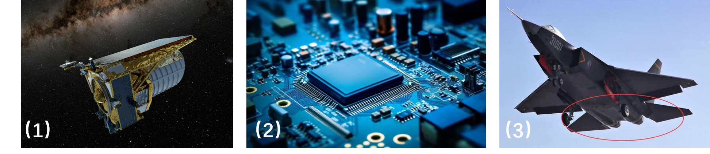
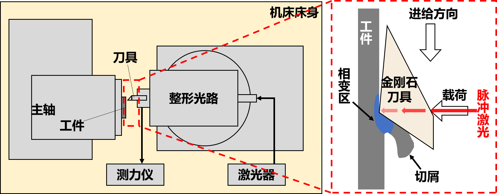
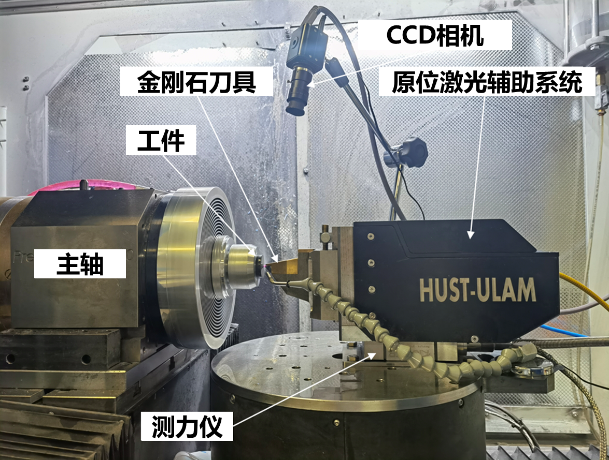
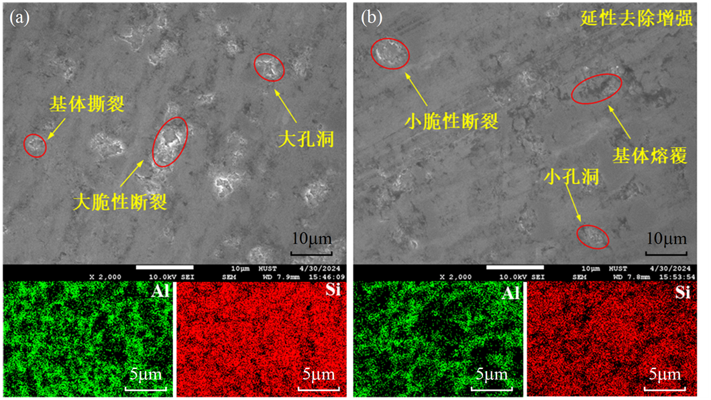
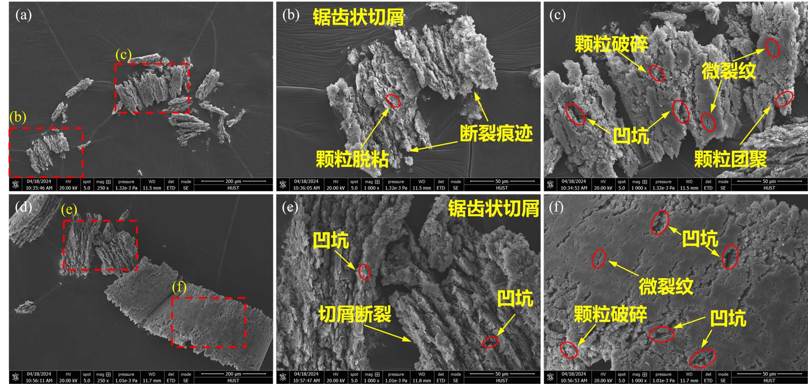

> 项目来源于韩思源 2024 年大连理工大学机械工程学院的本科毕业设计。

硅铝合金（Sip/Al）由于其比强度高、导热率高、热膨胀系数可控，是电子封装领域的关键材料。

_硅铝合金在（1）航天望远镜，（2）电子封装，（3)飞机腹鳍中的应用。_

然而 Sip/Al 复合材料作为一种**颗粒增强型复合材料**，使用传统的**单点金刚石切削**技术存在**硬质点磨损**、颗粒从**基体剥离**、加工表面质量差、**刀具磨损**严重等问题。

_激光原位辅助切削技术示意图_

**激光原位辅助切削技术**是一种有效实现其超精密加工的方法，其可弥补传统加工方式的不足，提高材料的塑性，降低切削力、减少刀具磨损，从而实现 Sip/Al 复合材料的**超精密加工**。

主要工作：

- 使用**Abaqus**建立了二维原位激光辅助切削 Sip/Al**仿真模型**。

_单点金刚石切削硅铝合金_

_激光原位辅助切削硅铝合金_

激光**软化**了 Si 颗粒及周围的铝基体，降低了表面应力，抑制裂纹扩展，减少了 Si 颗粒的崩碎，从而提高表面加工质量。

- 开展了硅铝合金的原位激光辅助切削机理的**实验研究**

  硅铝合金中 Si 颗粒体积分数为 50%，平均直径为 16μm。

  

  _实验装置设置_

  

  _表面质量对比（a）单点金刚石切削 （b）激光原位辅助切削_

  普通切削过程中，由于 Si 颗粒与 Al 基体产生挤压、刮擦，从而在 Al 基体上形成了大的划痕和 Al 基体撕裂，Si 颗粒由于脆性去除会产生崩碎，导致在 Al 基体中会产生大的空洞、凹坑和大裂纹。

  

  _切屑形态分析（a-c）单点金刚石切削 （d-f）激光原位辅助切削_

  激光束的引入，预热并软化了工件，Al 基体的变形阻力减少，晶界滑动容易，其受到刀具的前刀面挤压作用时，不易与 Al 基体发生分离，更容易获得连续的切屑。

<!--more-->
