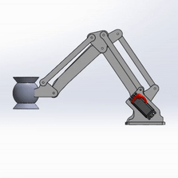
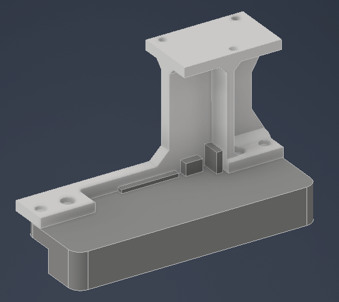
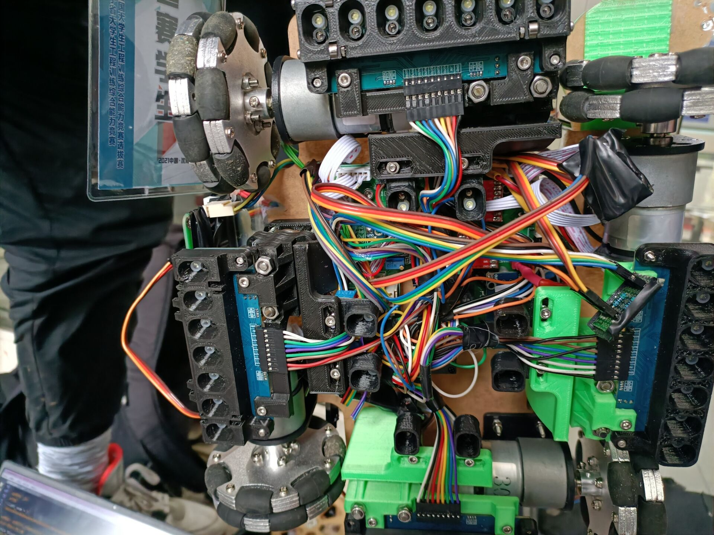

> 项目来源于韩思源 2021 年大学生工程训练综合能力竞赛辽宁省一等奖项目。

基于 STM32 微控制器设计并实现了一套智能物料搬运小车系统，集成全向移动控制、灰度寻迹、OpenMV 视觉识别及机械臂抓取，实现对不同颜色与形状物料的自主识别与搬运。

设计**平行四边形机构**机械臂，仅**3自由度**（图中为2自由度）降低控制难度，同时**优化物料夹持方式**，使其始终保持与地面**水平**，提高抓取与摆放成功率。

_机械臂设计_

完成全向轮移动**底盘结构设计**，优化整车**结构布局**。

_底盘布局设计_

_灰度传感器与底盘连接件（58mm小轮版）_

_全向轮移动底盘图_

根据物料形状设计了多种末端**夹爪结构**，设计辅助滚轮，增大抓取成功率。

_”灯笼“形物料夹爪_

_比赛图片_

_获奖证书_